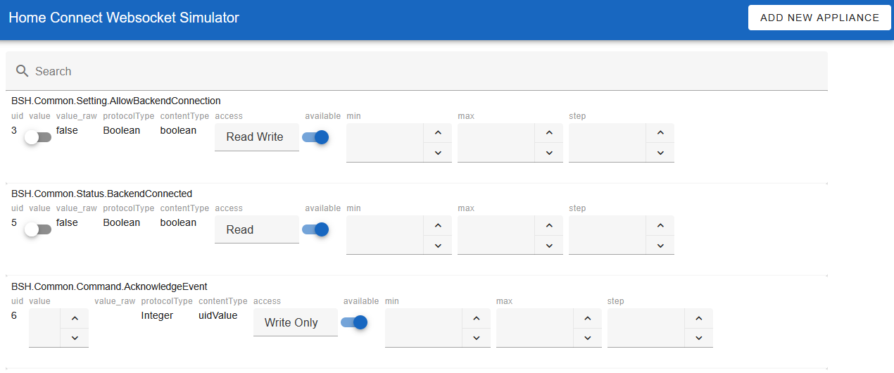

# HomeConnect Websocket Simulator

Simulator of the Websocket interface of a HomeConnect Appliance. For development and testing with the [HomeConnect Websocket](https://github.com/chris-mc1/homeconnect_websocket) client.

## Usage

* Install the prebuild Python Wheel from the newest Release
* Run 'python -m homeconnect_ws_sim' to start the simulator
* Open the Web GUI on Port 8080 in your Browser
* Click on "Add new Appliance" to open the Upload Dialog
* Upload a Profile file form the [Home Connect Profile Downloader](<https://github.com/bruestel/homeconnect-profile-downloader>) The first Appliance from the Profile file will be setup.
* A simulated Appliance is started using the Device description and PSK key found in the profile file
* When the Appliance is running the Web GUI is populated with entities.
* Connect to the simulator on port 443 with the HomeConnect client
* You can now use the Web GUI to manipulate the Value of an entity, the changes are send to the connected client

## Advanced option

* The Profile file upload also supports Diagnostic Dumps from the [Home Connect Local](https://github.com/chris-mc1/homeconnect_local_hass) Homeassistant integration. When using this option the full Appliance state will be restored.
* The used PSK Key can be overridden using a CLI argument.

## CLI Arguments

* '-f': Appliance save file, the Appliance config is saved to this file, and read on startup
* '-p': Web GUI port, default=8080
* '-psk': Override the Appliance PSK Key

## Limitations

* VERY Limited implementation of the WebSocket protocol ()
* No 'parentUID' in Description Change messages
* No support for Appliances with AES Encryption
